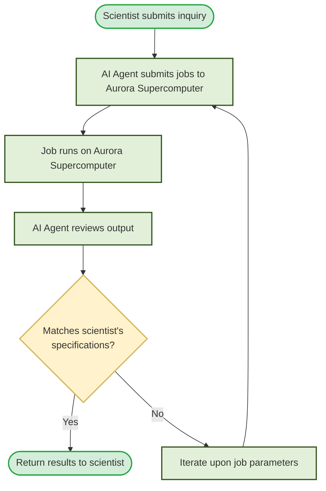

# 05-27-2026 Notes

## Meeting with Silvio, Jakub, and Mengjiao

### Abstract
First meeting with stake holders. 

Jakub is at ANL for 5 weeks and is working on adding a Kokkos backend to a 
finite element solver. Interesting work, primary impact is going to be 
benchmarking this backend against existing backends he has implemented. 
Benchmarks are going to start from simple (time to completion), to more systems 
focussed (memory bandwidth | throughput between host and GPU). Potential 
difficulities will arise when benchmarking between different super computers and 
instrumentations.

My project is to integrate agentic AI solutions with the larger IDEAS project 
targetting visualization generation. This will integrate with the larger agentic 
loop of job submission, review of job output, comparison to scientists 
requirements, iteration and improvement upon job parameters, and re-running 
the job with the updated parameters.

### IDEAS Project
The IDEAS project is a collaborative effort that is currently being lead by 
Dr. Victor Mateevitsi with collaborators located in the Viz. lab, ANL MCS + CPS 
divisions, and UC Davis. The general goal is the following mermaid:

The output of this flow chart is primarily focussed on visualizing the results 
of the job. These visualizations are produced in either Unity or Unreal Engine.
These were selected because the renderings are then sent to a VR/AR headset for
final viewing to the scientist(s). Additionally, the raw data is compressed into
two different formats
    
1. Intermediate neural representation (INR)
2. Multi-variable gaussians

Current work is to produce equivalent visualizations from these representations.

> NOTE: UC Davis collaborators are currently focussing on the INR representation

My work this summer is to expand upon the output visualizations to tooling 
including VTK and ParaView. These tooling are current candidates given their
Python interfaces that existing LLM solutions can take advantage of to generate
different scene renderings of the output.

However, more broadly my work is to integrate some degree of agentic AI soft[ware
engineering into the loop. I think this is most applicable to scene parameter
setup and hyper-parameter tuning of jobs.

#### Technical Information
No explicit agentic solution was specified during the meeting.

LangChain and LangGraph are two libraries currently in use.

Unity and Unreal Engine are currently rendering scenes to VR/AR headsets.

VTK, ParaView, and ParaView MCP are options to render scenes to and to integrate
with the agenentic system.

### Homework For 05-28-2026
- Create goals for weeks 1 - 10 to achieve
- Identify at least 3 venues to potentially submit to
