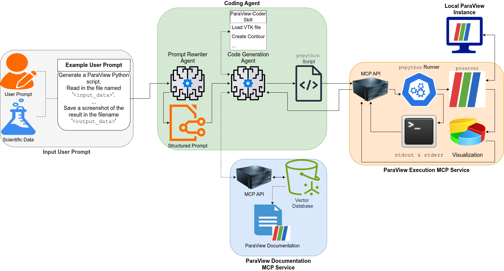

# Week 1 Deliverable: Project Charter

| Field    | Value                               |
| -------- | ----------------------------------- |
| Date     | 2026-06-04                          |
| Author   | Nicholas Synovic                    |
| Status   | Draft                               |
| Audience | ALCF Visualization Laboratory Staff |

---

## Problem Statement

Effective scientific visualization requires close coordination between domain
scientists and visualization experts. Domain scientists understand the data
deeply — they know what phenomena to look for, what parameters are meaningful,
and what a correct result should look like — but translating that intent into a
working ParaView pipeline requires visualization expertise that most scientists
do not have. Visualization experts, conversely, can construct technically
correct pipelines but lack the domain knowledge to independently determine what
is scientifically significant to render. This mismatch slows iteration: a
scientist who wants to explore a new camera angle, a different isosurface
threshold, or an alternative colormap must wait on a vis expert to implement it.
The result is reduced scientific agility and a narrower exploration of the
visualization parameter space than the data warrants. This collaboration gap is
the primary motivation for large language model (LLM) agents that domain
scientists can drive directly using informal natural language — not engineered
queries, but the kind of casual description a scientist would give a colleague.

As scientists routinely spend hours manually constructing ParaView pipelines to
inspect simulation outputs — time that could be redirected toward analysis and
insight. Agentic LLM systems offer a path to automating this process, but
existing approaches divide into two camps with distinct limitations:

1. code-generation agents (e.g., ChatVis) that are fast but fragile against API
   changes and accumulate errors across multi-step workflows,

2. tool-driven MCP agents (e.g., ParaView-MCP) that are stable but high-latency
   and narrowly constrained to predefined tool schemas, and

3. agent skills (Ai et al., SciVisAgentSkills, 2026) — structured, reusable
   packages of procedural knowledge encoding environment assumptions, tool usage
   patterns, API conventions, and domain heuristics.

Each of these approaches have their merits, code-generation agents can
iteratively improve the generated code by reading error logs and traces, tools
provide the model with visual information and the ability to steer visualization
software towards an ideal answer, and agent skills allows for repeatable
processes to be codified and loaded progressively into the agent's context.
However, **no work has systematically compared all three design axes together,
nor evaluated which combination of strategy, skill, and model produces the
highest visual quality under a consistent harness.**

Against this backdrop, no existing system has evaluated all three design axes —
code generation strategy, agent skill layer, and LLM backend — together under a
single fixed harness, nor examined which combination produces the highest visual
quality for domain scientists supplying informal natural language prompts.
SciVisAgentSkills explicitly leaves harness-skill interaction under OpenCode as
an open problem; this project addresses it directly. This project asks: **under
OpenCode as a fixed agent harness, which combination of visualization strategy
(few-shot code generation, RAG over code snippets, agent skills, structured MCP
tool calls, or RAG over API documentation) and LLM backend produces the highest
visual quality in ParaView when driven by informal natural language prompts from
domain scientists — and how does the answer vary as model size and capability
change?** The precise operationalization of visual quality for this setting is
itself an open research question that this project will address as part of its
evaluation methodology.

---

## Scope

This project targets ParaView as the sole visualization backend, with all code
execution running through `pvpython` on a headless ParaView instance. OpenCode,
connected to the ALCF Argo Gateway API, serves as the fixed agent harness
throughout — harness variation is not studied here, making every result directly
comparable across strategies and models. The central inquiry is how five
concrete strategies, differing in what procedural knowledge they inject and how,
affect visualization quality as the LLM backend and configuration vary. The
first strategy is **few-shot prompt improvement and code generation** (ChatVis
v1, Mallick et al. 2024), in which an LLM rewrites the scientist's prompt using
few-shot examples before generating a `pvpython` script that is executed and
iteratively repaired. The second is **RAG over ParaView code snippets** (ChatVis
v2, 2025), which replaces prompt improvement with retrieval: a FAISS index of
curated ParaView code snippets is queried at generation time and injected
directly into the code-generation prompt. The third is an **OpenCode-native
prompt-formatting subagent paired with a `paraview-coder` agent skill** (ChatVis
v3, extending SciVisAgentSkills, Ai et al. 2026), in which a dedicated subagent
shapes the user's informal request into a precise ParaView prompt and a
structured skill — encoding environment assumptions, API conventions, headless
rendering requirements, and observed `pvpython` failure modes — guides the
coding agent through script generation; the repair loop is delegated to the host
agent rather than hardcoded in a pipeline. The fourth strategy is **structured
MCP tool calls** (ParaView-MCP v1/v2, Liu et al. 2025), in which the coding
agent drives a live `pvserver` instance through a set of predefined, typed MCP
tools rather than generating free-form Python scripts. The fifth is a **planned
novel contribution**: a retrieval service over the full `paraview.simple` API
documentation, exposed as an MCP tool, which allows the agent to look up correct
API usage at generation time rather than relying on static code snippets or
manually curated skill heuristics. Evaluation draws on the ParaView-supported
benchmark cases from both NL2SciViz (Mathai et al. 2026) and SciVisAgentBench
(2026), augmented with the Taylor-Green Vortex CFD synthetic dataset. Rather
than optimizing for benchmark pass rates alone, the primary emphasis is on the
visual quality of the generated visualization as perceived by domain scientists
— the precise operationalization of visual quality for this setting is an open
research question that this project will address as part of its evaluation
methodology.

---

## System Design Decisions (M1.3)

### Visualization Backend

**ParaView** is the sole visualization backend. All code execution runs through
`pvpython` on a headless ParaView instance managed by a custom ParaView MCP
server (`paraview_mcp/`). This server accepts arbitrary Python scripts and
returns `stdout`, `stderr`, and a rendered screenshot — enabling an agentic
feedback loop without requiring the agent to control ParaView through a fixed
set of pre-defined tool calls.

### Agent Harness

**OpenCode** serves as the coding agent harness, wired to the **ALCF Argo
Gateway API**. The Argo Gateway provides access to both proprietary and open LLM
backends through a single OpenAI-compatible endpoint, eliminating the need for
separate API integrations. A dedicated OpenCode-native prompt-improvement
subagent pre-processes user queries, reformulating informal natural language
requests into the structured input format expected by the visualization
pipeline.

### LLM Backends

Backends are selected to span the proprietary/open and large/small axes, giving
a broad comparison surface. All proprietary models are accessed via the Argo
Gateway; all open models are accessed via the ALCF Inference Service.

| Tier              | Provider  | Model                 | Access                 |
| ----------------- | --------- | --------------------- | ---------------------- |
| Large proprietary | Anthropic | Claude Sonnet 4.6     | Argo Gateway           |
| Large proprietary | OpenAI    | GPT-5.5               | Argo Gateway           |
| Large proprietary | Google    | Gemini 2.5 Pro        | Argo Gateway           |
| Large open        | NVIDIA    | Nemotron 3 Super 120B | ALCF Inference Service |
| Small open        | Meta      | Llama 3.3 70B         | ALCF Inference Service |

### Compute

**Crux** (ALCF) is the primary compute target. Because the project relies on API
calls to hosted LLM services rather than self-hosting models, Crux's CPU
allocation is sufficient for the workload. Polaris and Sophia serve as fallback
targets if Crux allocations are unavailable for a given run.

---

## Input / Output Contract (M1.2)

### Input

A natural language prompt from a scientist, accompanied by a path to a
scientific dataset on the shared filesystem. Prompts are expected to be informal
and non-specific — e.g., _"Generate an isosurface of this data file in
ParaView"_ — rather than the precise, parameter-rich queries sometimes assumed
in prior work. Example prompts and datasets are drawn from:

- NL2SciViz benchmark (Mathai et al., 2026)
- SciVisAgentBench (2026)
- ChatVis V1 (Mallick et al., 2024) and V2 (2025)
- Taylor-Green Vortex (TGV) CFD synthetic dataset (sourced from Saumil Patel,
  ANL)

### Output

The system produces three artifacts per successful run:

| Artifact               | Format    | Notes                                                      |
| ---------------------- | --------- | ---------------------------------------------------------- |
| Rendered visualization | PNG image | Primary evaluation artifact; compared against ground truth |
| ParaView state file    | `.pvsm`   | Enables hard-coded state verification via `pvpython`       |
| Provenance log         | JSON      | Records every agent action, tool call, and iteration step  |

> **Deferred:** An interactive session URL (allowing the user to connect to the
> live remote ParaView instance) is architecturally desirable but deferred.
> Stateful MCP connections are difficult to implement reliably and are not
> required for the benchmarking goals of this summer.

---

## System Architecture (M1.4)

The following diagram illustrates the proposed agent → visualization pipeline →
HPC system interaction:

The pipeline operates in six stages:

1. **User prompt ingestion.** The scientist submits a natural language prompt
   and a dataset path. An OpenCode-native prompt-improvement subagent
   reformulates the prompt to match the structured input format expected
   downstream.

2. **Skill loading.** A `SKILL.md` file — merging code snippets from
   SciVisAgentSkills and ChatVis V1/V2 (HPC-Skills excluded as redundant) — is
   loaded into the coding agent's context. The agent uses the skill headers to
   determine whether to invoke the full skill or the downstream MCP services.

3. **Code generation.** The coding agent (OpenCode + Argo LLM backend) generates
   a ParaView Python script. This may draw on: (a) the `SKILL.md` code snippets
   directly, or (b) a RAG service querying an indexed copy of the ParaView
   documentation.

4. **Remote execution.** The generated script is passed to the ParaView MCP
   server, which forwards it to a headless `pvpython` instance running on Crux.
   The server returns `stdout`, `stderr`, and a rendered screenshot.

5. **Evaluation and feedback.** The agent inspects the returned artifacts. A
   hybrid evaluator — combining a multi-modal LLM judge (image quality) and a
   hard-coded `pvpython` state verifier (parameter correctness) — scores the
   output and generates structured feedback.

6. **Iteration.** If the output does not meet the goal, the agent revises the
   script and re-submits. The loop continues until the visualization passes
   evaluation or a step budget is exhausted.

---

## Success Criteria

This summer is considered successful if the following are delivered:

1. **Learning on the Lawn poster** (ANL internal; deadline TBD) — a visual
   summary of the system architecture, benchmark results, and key findings.

2. **SC26 Research Poster** —
   [CFP](https://sc26.supercomputing.org/program/posters/research-posters/),
   deadline **August 1, 2026**.

3. **AgenticAI4HPC @ SC26** (primary workshop target) —
   [CFP](https://ornl.github.io/events/agenticai4hpc2026), deadline **August 1,
   2026**, 10-page paper. Focus: agentic orchestration, intelligent
   coordination, and coupled simulation/data/AI workflows.

4. **AI4S @ SC26** (backup workshop target) —
   [CFP](https://ai4s.github.io/#cfp), deadline **August 8, 2026**, 8-page
   paper. Focus: generative AI for scientific discovery and development
   workflows.

Quantitative targets for the benchmark evaluation:

- Task completion rate (NL prompt → valid visualization, no human intervention)
  measured across all five LLM backends
- Tool call accuracy and per-step iteration counts
- Wall-clock time from prompt submission to visualization delivery
- Before/after comparison of context strategies (baseline: no context;
  treatment: `SKILL.md`, RAG, MCP variants)

---

## Open Items

| Item                           | Owner    | Status                 |
| ------------------------------ | -------- | ---------------------- |
| Interactive session URL output | Nicholas | Deferred (post-summer) |
