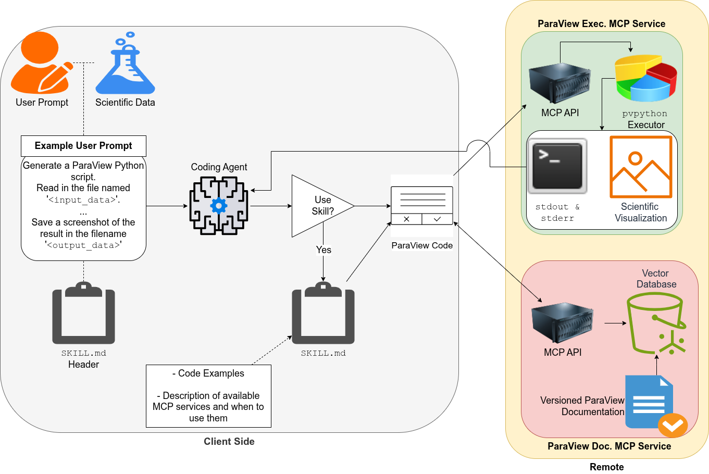

# Week 1 Deliverable: Project Charter

| Field    | Value                               |
| -------- | ----------------------------------- |
| Date     | 2026-06-04                          |
| Author   | Nicholas Synovic                    |
| Status   | Draft                               |
| Audience | ALCF Visualization Laboratory Staff |

---

## Problem Statement

Scientific visualization at extreme scale remains a significant bottleneck in
the scientific discovery process. Scientists routinely spend hours manually
constructing ParaView pipelines to inspect simulation outputs — time that could
be redirected toward analysis and insight. Agentic Large Language Model (LLM)
systems offer a path to automating this process, but existing approaches fall
into two camps with distinct limitations: code-generation agents (e.g., ChatVis)
that are fast but fragile against API changes, and tool-driven MCP agents (e.g.,
ParaView-MCP) that are stable but high-latency and narrowly scoped. No system
has systematically compared these strategies or explored the space of
intermediate solutions — for example, retrieval-augmented generation (RAG) over
the full ParaView documentation, or combining MCP execution with skill-guided
code generation. Critically, neither camp addresses the human dimension of the
problem: the bottleneck is not only technical, but collaborative.

Effective scientific visualization requires close coordination between domain
scientists and visualization experts. Domain scientists understand the data
deeply — they know what phenomena to look for, what parameters are meaningful,
and what a correct result should look like — but translating that intent into a
working ParaView pipeline requires visualization expertise that most scientists
do not have. Visualization experts, conversely, can construct technically
correct pipelines but lack the domain knowledge to independently determine what
is scientifically significant to render. This mismatch slows iteration: a
scientist who wants to explore a new camera angle, a different isosurface
threshold, or an alternative colormap must wait on a vis expert to implement it.
The result is reduced scientific agility and a narrower exploration of the
visualization parameter space than the data warrants. This collaboration gap is
the primary motivation for an agent that domain scientists can drive directly
using informal natural language — not engineered queries, but the kind of casual
description a scientist would give a colleague.

This bottleneck is especially acute in in-situ visualization settings, where
pipelines must be specified before a simulation begins and cannot be easily
revised once the experiment is running. While in-situ workflows are outside the
scope of this project, they illustrate how pervasive the cost of rigid,
expert-dependent visualization pipelines is across the scientific computing
stack. This project targets post-hoc interactive visualization in ParaView as a
concrete, tractable instance of the broader problem.

Against this backdrop, no existing system has evaluated whether prompt
engineering or context management is the more effective lever for improving
agent reliability — and whether the answer is stable across LLM backends of
different sizes and capabilities. This project asks: **which context-management
and prompt-engineering strategies produce the most reliable, accurate, and
efficient LLM-driven scientific visualizations in ParaView for domain scientists
using informal natural language prompts, and how does the answer vary across LLM
backends?**

---

## Scope

**In scope:**

- ParaView as the sole visualization backend (via `pvpython` and a custom
  ParaView MCP server)
- Comparing prompt-engineering vs. context-management strategies for LLM-driven
  visualization
- Benchmarking across multiple LLM backends using existing evaluation suites
  (NL2SciViz, SciVisAgentBench)
- Exploration of RAG over ParaView documentation, `SKILL.md`-based context
  injection, and MCP tool-driven execution as competing or composable strategies

**Out of scope:**

- Implicit Neural Representations (INRs), Multiplicative Filter Architectures
  (MFAs), Kolmogorov–Arnold Networks (KANs)
- Homomorphic data representations and neural rendering research
- Visualization backends other than ParaView (Ascent, VTK, matplotlib)
- User studies (require ANL IRB approval; timeline incompatible with summer
  internship)
- Agent-to-Agent (A2A) communication (out of scope for this summer; may be
  explored as a stretch goal)

---

## System Design Decisions (M1.3)

### Visualization Backend

**ParaView** is the sole visualization backend. All code execution runs through
`pvpython` on a headless ParaView instance managed by a custom ParaView MCP
server (`paraview_mcp/`). This server accepts arbitrary Python scripts and
returns `stdout`, `stderr`, and a rendered screenshot — enabling an agentic
feedback loop without requiring the agent to control ParaView through a fixed
set of pre-defined tool calls.

### Agent Harness

**OpenCode** serves as the coding agent harness, wired to the **ALCF Argo
Gateway API** via a local `argo-proxy` instance. The Argo Gateway provides
access to both proprietary and open LLM backends through a single
OpenAI-compatible endpoint, eliminating the need for separate API integrations.
A custom `smolagent`-based prompt-improvement subagent pre-processes user
queries to conform to the structured input format expected by the visualization
pipeline.

### LLM Backends

Backends are selected to span the proprietary/open and large/small axes, giving
a broad comparison surface. All proprietary models are accessed via the Argo
Gateway; all open models are accessed via the ALCF Inference Service.

| Tier              | Provider  | Model                 | Access                 |
| ----------------- | --------- | --------------------- | ---------------------- |
| Large proprietary | Anthropic | Claude Sonnet 4.6     | Argo Gateway           |
| Large proprietary | OpenAI    | GPT-5.5               | Argo Gateway           |
| Large proprietary | Google    | Gemini 2.5 Pro        | Argo Gateway           |
| Large open        | NVIDIA    | Nemotron 3 Super 120B | ALCF Inference Service |
| Small open        | Meta      | Llama 3.3 70B         | ALCF Inference Service |

### Compute

**Crux** (ALCF) is the primary compute target, selected because the project
relies on API calls to hosted LLM services rather than self-hosting models —
Crux's CPU allocation is sufficient and avoids contending for GPU hours. Polaris
and Sophia serve as fallback targets if Crux allocations are unavailable for a
given run.

---

## Input / Output Contract (M1.2)

### Input

A natural language prompt from a scientist, accompanied by a path to a
scientific dataset on the shared filesystem. Prompts are expected to be informal
and non-specific — e.g., _"Generate an isosurface of this data file in
ParaView"_ — rather than the precise, parameter-rich queries sometimes assumed
in prior work. Example prompts and datasets are drawn from:

- NL2SciViz benchmark (Mathai et al., 2026)
- SciVisAgentBench (2026)
- ChatVis V1 (Mallick et al., 2024) and V2 (2025)
- Taylor-Green Vortex (TGV) CFD synthetic dataset (sourced from Saumil Patel,
  ANL)

### Output

The system produces three artifacts per successful run:

| Artifact               | Format    | Notes                                                      |
| ---------------------- | --------- | ---------------------------------------------------------- |
| Rendered visualization | PNG image | Primary evaluation artifact; compared against ground truth |
| ParaView state file    | `.pvsm`   | Enables hard-coded state verification via `pvpython`       |
| Provenance log         | JSON      | Records every agent action, tool call, and iteration step  |

> **Deferred:** An interactive session URL (allowing the user to connect to the
> live remote ParaView instance) is architecturally desirable but deferred.
> Stateful MCP connections are difficult to implement reliably and are not
> required for the benchmarking goals of this summer.

---

## System Architecture (M1.4)

The following diagram illustrates the proposed agent → visualization pipeline →
HPC system interaction:

The pipeline operates in six stages:

1. **User prompt ingestion.** The scientist submits a natural language prompt
   and a dataset path. A `smolagent`-based subagent optionally reformulates the
   prompt to match the structured input format expected downstream.

2. **Skill loading.** A `SKILL.md` file — combining code snippets from
   SciVisAgentSkills and ChatVis V1/V2 — is loaded into the coding agent's
   context. The agent uses the skill headers to determine whether to invoke the
   full skill or the downstream MCP services.

3. **Code generation.** The coding agent (OpenCode + Argo LLM backend) generates
   a ParaView Python script. This may draw on: (a) the `SKILL.md` code snippets
   directly, or (b) a RAG service querying an indexed copy of the ParaView
   documentation.

4. **Remote execution.** The generated script is passed to the ParaView MCP
   server, which forwards it to a headless `pvpython` instance running on Crux.
   The server returns `stdout`, `stderr`, and a rendered screenshot.

5. **Evaluation and feedback.** The agent inspects the returned artifacts. A
   hybrid evaluator — combining a multi-modal LLM judge (image quality) and a
   hard-coded `pvpython` state verifier (parameter correctness) — scores the
   output and generates structured feedback.

6. **Iteration.** If the output does not meet the goal, the agent revises the
   script and re-submits. The loop continues until the visualization passes
   evaluation or a step budget is exhausted.

---

## ALCF Project Milestone Mapping (M1.4)

This project advances **ALCF Project IDEAS Milestones [PLACEHOLDER]** and
**[PLACEHOLDER]**. Specifically:

- The ParaView MCP server and agentic harness are direct contributions to the
  team's ongoing work on AI-assisted scientific tooling.
- The benchmark suite and evaluation methodology provide a reusable framework
  for measuring the effectiveness of agentic visualization systems on DOE HPC
  infrastructure.
- The multi-model comparison generates empirical evidence to inform future model
  selection decisions across the ALCF Visualization Laboratory's AI-assisted
  tooling stack.

---

## Success Criteria

This summer is considered successful if the following are delivered:

1. **Learning on the Lawn poster** (ANL internal; deadline TBD) — a visual
   summary of the system architecture, benchmark results, and key findings.

2. **SC26 Research Poster** —
   [CFP](https://sc26.supercomputing.org/program/posters/research-posters/),
   deadline **August 1, 2026**.

3. **AgenticAI4HPC @ SC26** (primary workshop target) —
   [CFP](https://ornl.github.io/events/agenticai4hpc2026), deadline **August 1,
   2026**, 10-page paper. Focus: agentic orchestration, intelligent
   coordination, and coupled simulation/data/AI workflows.

4. **AI4S @ SC26** (backup workshop target) —
   [CFP](https://ai4s.github.io/#cfp), deadline **August 8, 2026**, 8-page
   paper. Focus: generative AI for scientific discovery and development
   workflows.

Quantitative targets for the benchmark evaluation:

- Task completion rate (NL prompt → valid visualization, no human intervention)
  measured across all five LLM backends
- Tool call accuracy and per-step iteration counts
- Wall-clock time from prompt submission to visualization delivery
- Before/after comparison of context strategies (baseline: no context;
  treatment: `SKILL.md`, RAG, MCP variants)

---

## Open Items

| Item                           | Owner    | Status                 |
| ------------------------------ | -------- | ---------------------- |
| Interactive session URL output | Nicholas | Deferred (post-summer) |
