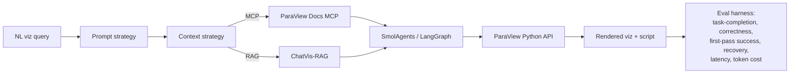

# ALCF 2026 — 10-Week Plan of Record

> Living plan-of-record for the ALCF 2026 summer project. Supersedes the
> embedded weekly tables in earlier daily notes. Daily notes should link here
> rather than duplicate the plan.
>
> Charter (unchanged): [`week1_deliverable.md`](week1_deliverable.md).

## Project Framing

**One-line thesis**: compare prompt-engineering and context-management
strategies for LLM-driven scientific visualization, using ParaView as the
visualization backend and a reimplemented ChatVis-mini harness as the
experimental substrate.

The minimum viable result (MVR) is a head-to-head benchmark of two context
strategies — a **ParaView Docs MCP server** vs. a **ChatVis RAG pipeline** — on
a fixed set of NL → visualization tasks. Additional prompt strategies
(zero-shot, few-shot, structured decomposition, self-critique) and additional
context strategies (function-calling, hierarchical retrieval, summarization
caches) layer on top of the same harness.

## Scope

**In scope** (Weeks 3–7 drive these):

- Prompt strategies: zero-shot, few-shot, structured decomposition,
  self-critique / reflexion-lite.
- Context strategies: ParaView Docs MCP, ChatVis-style RAG, function-calling
  tool exposure, hierarchical doc retrieval, summarization-cache for long
  sessions.
- Eval harness: fixed task set, repeatable scoring, agent-executable QA.
- One end-to-end CFD demo on TGV (Taylor–Green Vortex) data once Dr. Patel's
  dataset lands.

**Explicitly out of scope** (per 06-02 scope-down): INRs, MFAs, KANs,
homomorphic data representations, neural rendering. If a question doesn't help
decide between prompt or context strategies, it's not on the main track.

**Stretch / If Time Permits** (descoped from main timeline; pursue only after W8
if schedule allows):

- Multi-agent A2A coordination (planner ↔ executor ↔ critic).
- Large-scale stress benchmarking on Polaris (multi-node, large datasets).
- PEFT / LoRA distillation of the best prompt+context configuration into a
  smaller model.

## Target Venue

- **Primary**: AgenticAI4HPC — best thesis fit; the comparative benchmark is
  exactly the workshop's interest area.
- **Backup**: EduHPC — fallback if AgenticAI4HPC dates don't align or scope
  contracts further.

## Compute & LLM Backends

| Resource             | Status    | Use                                              |
| -------------------- | --------- | ------------------------------------------------ |
| Polaris              | ✓         | Dev + medium runs                                |
| Sophia               | ✓         | GPU dev                                          |
| Crux                 | ✗ blocked | Target for batch eval (EVITA)                    |
| Argo Gateway API     | ✓         | Claude Sonnet 4.6, GPT 5.5                       |
| ALCF Inference       | ✓         | Nemotron 3 Super 120B, Gemma4 31B, Llama 3.3 70B |
| ALCF Batch Inference | ✓         | Bulk eval sweeps                                 |
| DGX Spark            | ◐ pending | Local dev (per Victor)                           |

## Evaluation Metrics

Every prompt × context configuration is scored on:

1. **Task-completion rate** — did the agent produce a runnable ParaView script
   for the query?
2. **Visualization correctness** — does the rendered output match ground-truth
   (rubric + image diff against reference).
3. **First-pass success** — completion without retries.
4. **Recovery rate** — when the first pass fails, does self-critique / retry
   recover?
5. **Latency** — wall-clock per query, end-to-end.
6. **Token cost** — total input + output tokens per query (proxy for $).

## 10-Week Timeline

| Week | Dates window | Theme                            | Primary deliverable                          |
| ---- | ------------ | -------------------------------- | -------------------------------------------- |
| 1    | done         | Scoping + charter                | `week1_deliverable.md`                       |
| 2    | in progress  | Review + setup                   | ChatVis-mini harness skeleton; MCP unblocked |
| 3    | upcoming     | ParaView MCP PoC + first NL→viz  | One working NL→viz round-trip on laptop      |
| 4    |              | ChatVis-mini in SmolAgents       | Swappable prompt + context interfaces        |
| 5    |              | Docs-MCP vs. ChatVis-RAG harness | First A/B benchmark numbers (MVR)            |
| 6    |              | Prompt-strategy sweep            | Prompt strategies × both contexts            |
| 7    |              | Context-strategy sweep           | Context strategies × best prompt             |
| 8    |              | Poster                           | AgenticAI4HPC poster draft                   |
| 9    |              | Report + repo + video            | Final write-up, clean repo, demo             |
| 10   |              | AgenticAI4HPC submission         | Submitted artifact + retro                   |

## Week 2 — Review + Setup (in progress)

- M2.1 — Walk the NERSC MCP tutorial; capture deltas vs. our `pv_external_mcp`
  setup.
- M2.2 — Port ParaView MCP fixes from SciVisAgent into `LLNL/paraview_mcp` (or a
  fork); make `pv_external_mcp` start cleanly under current FastMCP.
- M2.3 — Stand up basic ChatVis-in-SmolAgents with prompt + context seams as
  config.
- M2.4 — Unblock Crux (or commit to Polaris/Sophia for dev for the remainder of
  the project).
- M2.5 — Confirm candidate LLM list (Argo + ALCF Inference) — DONE.
- M2.6 — `argo-shim` / `argo-proxy` on an HPC login node.
- M2.7 — Refresh project bibliography against the new scope.
- M2.8 — Capture relevant in-situ / Globus-Flows research in
  [`perplexity_in-situ.md`](perplexity_in-situ.md) and
  [`perplexity_globus-flows-compute.md`](perplexity_globus-flows-compute.md) for
  W6/W7 reference.

## Week 3 — ParaView MCP PoC + first NL→viz

- M3.1 — One canonical NL → ParaView script round-trip via MCP on a laptop.
- M3.2 — Define the v0 task set (5–10 NL queries) used by the eval harness.
- M3.3 — Stub eval harness: load task, dispatch to agent, capture script +
  render.
- M3.4 — Choose ground-truth dataset for dev (small CFD or stock ParaView
  example until TGV lands).
- M3.5 — Record latency + token-cost instrumentation conventions.

## Week 4 — ChatVis-mini in SmolAgents

- M4.1 — Reimplement a minimal slice of ChatVis (script generation + execution
  loop) inside SmolAgents.
- M4.2 — Expose **prompt strategy** as a swappable interface
  (config-selectable).
- M4.3 — Expose **context strategy** as a swappable interface
  (config-selectable).
- M4.4 — Wire Argo + ALCF Inference backends behind a single `LLMClient`
  abstraction.
- M4.5 — End-to-end smoke test: same NL query produces a script via each
  backend.

## Week 5 — Docs-MCP vs. ChatVis-RAG harness (MVR)

- M5.1 — Implement context strategy A: ParaView Docs MCP server (tool-exposed
  docs + function-calling).
- M5.2 — Implement context strategy B: ChatVis-RAG (vector retrieval over
  ParaView docs + ChatVis prompts).
- M5.3 — Run the v0 task set through both, with a fixed baseline prompt
  strategy.
- M5.4 — First numbers: task-completion, correctness, first-pass success,
  latency, token cost.
- M5.5 — Decide whether MVR meets workshop bar; if not, what's the single
  biggest gap?

## Week 6 — Prompt-strategy sweep

- M6.1 — Add prompt strategies: zero-shot, few-shot, structured decomposition,
  self-critique.
- M6.2 — Run prompts × {MCP, RAG} on the v0 task set.
- M6.3 — Recovery-rate study: how often does self-critique rescue a failed first
  pass?
- M6.4 — Identify the prompt strategy that dominates per context.

## Week 7 — Context-strategy sweep

- M7.1 — Add context variants: hierarchical retrieval, summarization cache,
  function-calling-only.
- M7.2 — Run best prompt × all context strategies on v0 + expanded task set.
- M7.3 — Cost / quality Pareto plot.
- M7.4 — Pick the recommended prompt + context pairing for the write-up.
- M7.5 — If TGV data is in hand, run the recommended pairing on the full CFD
  demo.

## Week 8 — Poster

- M8.1 — Poster draft (AgenticAI4HPC format).
- M8.2 — Internal review with George / Silvio.
- M8.3 — Final figures: timeline, Pareto plot, sample NL → viz transcripts.
- M8.4 — Demo video stub.

## Week 9 — Report + repo + video

- M9.1 — Final write-up (workshop short paper or technical report).
- M9.2 — Repo cleanup: reproducibility README, eval harness CLI, `tasks.md`
  parity with what shipped.
- M9.3 — Polished demo video (5–8 minutes).

## Week 10 — AgenticAI4HPC submission

- M10.1 — Submit to AgenticAI4HPC.
- M10.2 — Retro: what worked, what didn't, what to publish next.
- M10.3 — Decide which Stretch items (A2A / stress / PEFT) are worth pursuing
  post-internship.

## Cross-Cutting Open Threads

- Crux access (EVITA project allocation) — George / Silvio.
- TGV CFD dataset — Dr. Saumil Patel via Silvio Slack intro.
- DGX Spark user / access path — Victor.
- `argo-shim` / `argo-proxy` deployment on HPC login node.
- Workday + benefits — Melissa.
- ParaView MCP upstream fix path —
  [`LLNL/paraview_mcp`](https://github.com/LLNL/paraview_mcp) + SciVisAgent.

## Success Criteria

- MVR shipped by end of Week 5 (Docs-MCP vs. ChatVis-RAG numbers on v0 task
  set).
- Both prompt and context sweeps complete by end of Week 7.
- One CFD demo end-to-end with the recommended configuration.
- Submission to AgenticAI4HPC in Week 10.
- Repo is reproducible by a new collaborator from the README alone.
