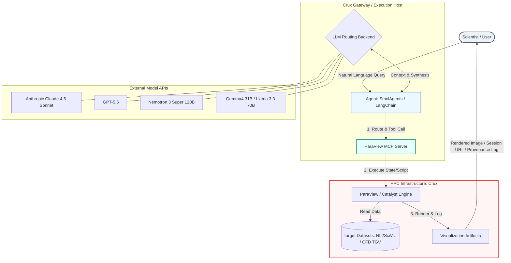

# Project Charter: Agentic Orchestration for Scientific Visualization

## Project Overview & Alignment

### Purpose

This project focuses on the development of large language model (LLM)-based
agentic assistants capable of orchestrating scientific data visualization
workflows on U.S. Department of Energy (DOE) high-performance computing (HPC)
infrastructure. The primary objective is to lower the barrier to entry for
domain scientists interacting with high-performance visualization tools by
translating natural language requests into complex, reproducible visualization
pipelines.

### Strategic Alignment

This project directly advances core institutional milestones, specifically:

- **Milestone 7:** Redacted
- **Milestone 8:** Redacted

The work bridges the gap between automated AI reasoning and large-scale
scientific computing infrastructure, positioning the laboratory at the forefront
of AI-augmented scientific discovery.

## High-Level System Architecture

### System Overview

The system architecture defines the end-to-end lifecycle of a scientist's
request, from natural language input through the agent orchestration layer via
the Model Context Protocol (MCP), to execution on HPC infrastructure and return
of visualization artifacts. The following diagram illustrates this lifecycle.



### Architectural Components

The system comprises four principal layers:

1. **User Layer:** The scientist provides a natural language query describing
   the desired visualization.
2. **Agent & Intelligence Layer:** An agentic framework (SmolAgents or
   LangChain) interprets the query, routes tool calls to the MCP server, and
   coordinates with one or more LLM backends for context synthesis and
   reasoning.
3. **External Model APIs:** A set of proprietary and open-weight LLM backends,
   accessed via API gateways or local endpoints, provide the reasoning
   capabilities that drive agent behavior.
4. **HPC Infrastructure (Crux):** The ParaView MCP Server translates agent tool
   calls into executable ParaView scripts or state files, reads from target
   datasets, and produces rendered visualization artifacts.

## Operational Specification

### Technical Stack & Dependencies

| Component                  | Selection                             | Notes                                                                                                                                                     |
| -------------------------- | ------------------------------------- | --------------------------------------------------------------------------------------------------------------------------------------------------------- |
| **Primary Compute Target** | Crux                                  | Utilized primarily for running orchestration infrastructure and external API coordination, rather than local model self-hosting.                          |
| **Agent Framework**        | SmolAgents (baseline)                 | Leverages prior configurations from the Genius project. If integration roadblocks are encountered, the architecture will pivot to LangChain or LangGraph. |
| **Visualization Backend**  | ParaView + custom ParaView MCP Server | Fallback options include Catalyst, Ascent, VTK, and matplotlib.                                                                                           |

### Target LLM Evaluation Matrix

The agent framework will evaluate and compare performance across three distinct
tiers of LLM backends. The tiered structure enables systematic comparison of
cost, latency, capability, and deployment flexibility.

| Tier       | Classification | Model Candidate(s)                   | Access Method |
| ---------- | -------------- | ------------------------------------ | ------------- |
| **Tier 1** | Proprietary    | Anthropic Claude Sonnet 4.6, GPT-5.5 | API Gateway   |
| **Tier 2** | Open Large     | Nemotron 3 Super 120B                | API Gateway   |
| **Tier 3** | Open Small     | Gemma4 31B, Llama 3.3 70B            | API Gateway   |

### Target Datasets & Evaluation Data

The system will be validated against two categories of data:

- **Baseline Benchmarking Data:** Standard datasets provided by ParaView, as
  identified in the NL2SciViz benchmark paper. These serve as controlled
  reference points for evaluating agent correctness and visualization fidelity.
- **Domain-Specific Data:** Computational Fluid Dynamics (CFD) data generated
  from the Taylor-Green Vortex (TGV) application simulation. This dataset is
  being prepared in coordination with Dr. Saumil Patel

### Interface Contract

#### Input Specification

The system accepts natural language queries from a scientist describing a
desired visualization operation.

- **Example Prompt:** > "Generate a contour plot of dark matter density at
  timestep 400 with a threshold above 1e3." _This example is derived from
  reference criteria published in the NL2SciViz benchmark (DOI:
  10.2312/evs.20261017)._

#### Output Specification

The system produces an orchestrated scientific visualization artifact consisting
of one or more of the following:

- A rendered image (e.g., PNG, TIFF) of the requested visualization.
- An interactive session URL enabling the scientist to explore the visualization
  in a live ParaView session.
- A ParaView state file (`.pvsm`) encoding the full visualization pipeline for
  reproducibility.

All outputs are accompanied by a **comprehensive provenance log** detailing the
sequence of automated actions taken by the agent, including tool calls,
parameter selections, and any error-recovery steps.

## Execution Roadmap & Milestones

### Timeline Overview

The project follows a 10-week execution timeline organized into four phases:
Foundation, Prototyping, Evaluation, and Deliverables.

```mermaid
gantt
    title 10-Week Execution Timeline
    dateFormat  X
    axisFormat Week %0y

    section Foundation
    W1: Scoping & Setup           :active, w1, 0, 1
    W2: Review & Environment Setup: w2, after w1, 1w

    section Prototyping
    W3: MVP Agent & MCP Demo     : w3, after w2, 1w
    W4: Multi-Agent & Routing     : w4, after w3, 1w

    section Evaluation
    W5: Small Benchmarks          : w5, after w4, 1w
    W6: Large-Scale Stress Tests  : w6, after w5, 1w
    W7: Model Optimization        : w7, after w6, 1w

    section Deliverables
    W8: Poster Draft              : w8, after w7, 1w
    W9: Final Report & Submission : w9, after w8, 1w
    W10: Workshop Paper Submission: w10, after w9, 1w

```

### Milestone Descriptions

#### Phase 1: Foundation

| Week   | Milestone                        | Description                                                                                                                                                                                           | Status        |
| ------ | -------------------------------- | ----------------------------------------------------------------------------------------------------------------------------------------------------------------------------------------------------- | ------------- |
| **W1** | Scoping & Setup                  | Project charter finalization, initial alignment on data sources, and system interface contracts.                                                                                                      | **COMPLETED** |
| **W2** | Review, Setup & Model Candidates | Establish the working environment on Crux; conduct baseline testing of API communication loops; produce a technical initialization memo documenting environment configuration and access credentials. | _Planned_     |

#### Phase 2: Prototyping

| Week   | Milestone                           | Description                                                                                                                                                                                                              | Status    |
| ------ | ----------------------------------- | ------------------------------------------------------------------------------------------------------------------------------------------------------------------------------------------------------------------------ | --------- |
| **W3** | MVP Agent + MCP + Multi-Model Test  | Deliver an end-to-end capability proof consisting of a rudimentary MCP server connected to ParaView, driven by the SmolAgents framework. Demonstrate at least one successful natural-language-to-visualization pipeline. | _Planned_ |
| **W4** | Multi-Agent + A2A + Backend Routing | Deploy advanced multi-step workflows incorporating agent-to-agent (A2A) communication, backend routing logic across LLM tiers, and generation of concrete architectural diagrams reflecting the implemented system.      | _Planned_ |

#### Phase 3: Evaluation

| Week   | Milestone                                | Description                                                                                                                                                                   | Status    |
| ------ | ---------------------------------------- | ----------------------------------------------------------------------------------------------------------------------------------------------------------------------------- | --------- |
| **W5** | Small Benchmarks & Model Comparison      | Conduct comparative evaluation across selected model tiers using the NL2SciViz benchmark suite. Produce targeted model performance recommendations with quantitative metrics. | _Planned_ |
| **W6** | Large-Scale Stress Benchmarks            | Perform robustness testing on HPC infrastructure using larger datasets (including TGV CFD data). Execute automated failure mode and edge-case analysis.                       | _Planned_ |
| **W7** | Model Optimization & Targeted Refinement | Conduct hyperparameter adjustment, prompt refinement, and system stabilization. Freeze the final system configuration for deliverable production.                             | _Planned_ |

> `[ACTION REQUIRED: Define the specific quantitative evaluation metrics to be used in Weeks 5–7 (e.g., task completion rate, visualization correctness score, latency, token cost per query, error recovery rate). Specify pass/fail thresholds where applicable.]`

#### Phase 4: Deliverables

| Week    | Milestone                 | Description                                                                                                         | Status    |
| ------- | ------------------------- | ------------------------------------------------------------------------------------------------------------------- | --------- |
| **W8**  | Poster Draft              | Produce initial visual and narrative layouts for the Learning on the Lawn poster session.                           | _Planned_ |
| **W9**  | Final Report & Submission | Consolidate the codebase repository, produce an end-to-end walkthrough video, and deliver the final project report. | _Planned_ |
| **W10** | Workshop Paper Submission | Complete and submit a peer-reviewed workshop paper to a targeted Supercomputing (SC) workshop venue.                | _Planned_ |

## Success Criteria

The project will be evaluated against the successful execution of the 10-week
timeline, culminating in two high-visibility deliverables:

| #     | Criterion                   | Description                                                                                                  | Verification Method                                 |
| ----- | --------------------------- | ------------------------------------------------------------------------------------------------------------ | --------------------------------------------------- |
| **1** | Institutional Dissemination | Presentation of findings at the local Learning on the Lawn poster session.                                   | Poster presented; audience feedback collected.      |
| **2** | Academic Publication        | A submission-ready workshop paper accepted or under review at a targeted Supercomputing (SC) workshop venue. | Confirmation of submission to the identified venue. |

## References

1. NL2SciViz Benchmark. DOI: 10.2312/evs.20261017.
